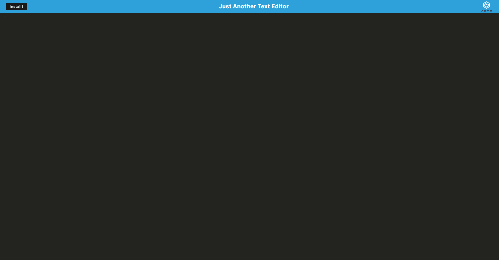

# <u>Just Another Text Editor </u>

  

  
  

  ## <u>Table of Contents:</u>
  ### [License](#license)
  ### * [Description](#description)
  ### * [Installation](#install)
  ### * [Usage](#usage)
  ### * [Contributors](#contributors)
  ### * [Testing](#testing)
  ### * [Questions](#questions)

  ## License
  ### MIT

  ## <u>Description</u>
  ### This is a web based text editor that can be downloaded with a PWA

  ## Built With: 
- JavaScript
- Webpack
- IndexedDB
- Node.js

  ## <u>Installation:</u>
  ### Please follow these steps to install:
  ### Click the install button, or visit the deployed link: https://damp-harbor-54602.herokuapp.com/

  ## <u>Usage:</u>
  ### You can use it just like your favorite text editor. 

  ## <u>Contributors:</u> 
  ### Alex Defrese

  ## <u>Testing:</u>
  ### Please follow these steps to test the project:
  ### Try to run your favorite code in the text editor. 

  ## <u>Questions:</u> 
  ### If you have any questions or suggestions, please contact me through either
  ### GitHub: https://github.com/AlexDefrese
  ### or
  ### Email: aidandefrese@gmail.com

